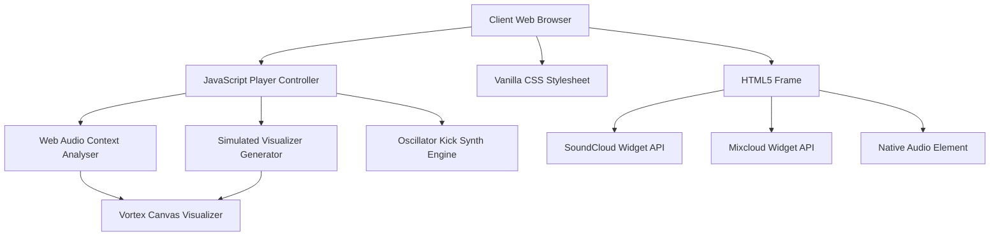

# Product Requirements Document (PRD) - Stimulain Artist Portal

This document defines the core product specification, operational runbook, technical architecture, and long-term roadmap for the Stimulain Official Artist Portal.

---

## 1. Problem Statement
Electronic music artists and music producers often struggle to present their portfolio (original tracks, remixes, live sets, sample packs, and presets) in a unified, distraction-free environment. Standard social media platforms (SoundCloud, Mixcloud, Linktree, Instagram) fragment the listener's experience, inject advertisements, and fail to convey a cohesive, high-fidelity visual and auditory brand. The Stimulain Artist Portal solves this problem by providing a bespoke, immersive web platform that consolidates media links and streams, features a high-fidelity interactive spectrum analyzer visualizer, and acts as a central node for bookings.

---

## 2. Target Users
*   **The Cyber-Music Fan / Listener**: Enthusiasts of experimental electronic music, techno, and atmospheric soundscapes who want to stream Stimulain's music and sets with zero interruptions and a matching high-contrast visualizer.
*   **The Booking Agent / Event Promoter**: Industry professionals looking to quickly assess Stimulain's performance style, scan historical DJ sets, and establish direct contact for bookings.
*   **The Music Producer / Sound Designer**: Creators seeking specialized sample packs and preset collections mentioned in the artist's brand.

---

## 3. Goals
*   Provide a premium, zero-latency custom audio player that plays master MP3 tracks natively.
*   Incorporate an interactive visualizer (vortex visualizer) reacting dynamically to Web Audio API frequency bands.
*   Mitigate local browser security constraints (CORS) by providing a robust simulated synthesizer loop fallback when executing via `file://`.
*   Consolidate external streaming footprints (SoundCloud and Mixcloud) into a compact, unified media grid.
*   Maintain a 100% client-side, zero-database, serverless static portal deployment structure.

---

## 4. Non-Goals
*   Building an in-portal social network, comment section, or forum (handled by SoundCloud/Mixcloud overlays).
*   Implementing direct ecommerce transactions or cart management (transacted offsite via Patreon, Bandcamp, etc.).
*   Collecting user logins, profiles, or tracking detailed user telemetry (beyond simple, privacy-friendly analytics).

---

## 5. User Stories
*   *As a cyber-music listener*, I want to open the site, select a track, and hear it immediately while watching a dynamic visualizer that pulsates to the bass line, so that I can enjoy an immersive artistic showcase.
*   *As a booking agent*, I want to access official DJ sets (Mixcloud logs) and stream them in the background while checking booking details, so that I can quickly evaluate the artist's set flow and make booking decisions.
*   *As a developer*, I want to load the project repository and run it locally with or without a web server, so that I can audit or expand the interface without hitting silent CORS audio load blocks.

---

## 6. Feature List
### MVP (Must Ship)
1.  **Custom Audiophile Player**: Direct controls (Play/Pause, Previous, Next, Volume seek, and interactive progress scrubbing) for localized high-quality master MP3s.
2.  **Circular Vortex Visualizer**: Canvas-based 2D visualizer wrapping around a rotating, blurred cover-art core. Animates and scales dynamically.
3.  **Local CORS Synthesizer Fallback**: Renders dummy visualizer waves and a simulated 130 BPM techno kick loop (MIDI oscillator nodes) if browser constraints block access to raw MP3 bytes.
4.  **Social & Stream Embeds**: Lightweight iframe widgets from SoundCloud (remixes) and Mixcloud (extended mixes), alongside official external profile links.
5.  **Branding and Bio Banner**: High-contrast, glassmorphic card design displaying the artist identity and direct email channel.

### Future (Post-Launch)
1.  **Direct Sample Pack Downloader**: Integrated local file zip delivery with signature key verification.
2.  **Canvas Visualizer Mode Selector**: Toggle between Circular Vortex, Horizontal Bars, and Oscilloscope lines.
3.  **Ableton Link Sync**: Web-sockets based integration to sync the local visualizer canvas tempo to a live Ableton session.

---

## 7. Constraints
*   **No Backend Dependency**: Must run as a purely static site (HTML, CSS, JS) deployable to GitHub Pages.
*   **Browser Sandbox Limits**: Must work within standard browser security sandbox permissions (e.g. autoplay policies requiring user interaction first).
*   **Audio CORS Restrictions**: Browsers prevent `AudioContext` nodes from reading pixel/frequency bytes from cross-origin files or local directories (`file://`) unless explicit HTTP headers are configured.

---

## 8. Assumptions
*   Users have standard web browser environments (Chrome 90+, Safari 14+, Firefox 90+, Edge 90+) supporting the Web Audio API and HTML5 Canvas.
*   The primary method of deployment will be GitHub Pages or Vercel's static content network.
*   Media streams for third-party embeds (SoundCloud, Mixcloud) will continue to allow iframe framing under default configurations.

---

## 9. Success Criteria
*   **Page Load Time**: Document structure loads and renders styling in under 1.5 seconds on standard 4G/Broadband networks.
*   **Zero Silent Crashes**: If local MP3 files fail to stream, the custom player successfully catches the error and transitions to the synthesized engine fallback within 500ms.
*   **Responsive Integrity**: Flawless visual display from ultra-mobile (320px width) up to 4K desktop configurations.

---

## 10. Product Tenets

### 1. Immersive Aesthetic First
*Priority: 1*
Visual design and thematic mood must feel premium, deep, and cybernetic. Never sacrifice the dark, glowing aura of the portal for generic layouts or browser-default UI patterns. Every interaction (hover, active click, transition) must have micro-animations.

### 2. Audio Reliability Over All
*Priority: 2*
If the audio fails, the portal fails. If a local audio source fails to play due to network issues, missing files, or CORS browser blockages, the portal must gracefully degrade to a simulated synthesizer mode rather than throwing error dialogs or leaving the play controls unresponsive.

### 3. Lightweight Client-Only Core
*Priority: 3*
Maintain zero framework overhead. Do not introduce React, Vue, build bundle bundlers (Webpack, Vite), or package dependencies unless absolutely necessary. Vanilla HTML, CSS, and JS ensure maximum longevity, security, and instantaneous load times.

---

## 11. Roadmap

### Current Phase: Phase 1 (MVP Launch)
We are currently in Phase 1. The core static player is fully functional, supporting two primary master tracks, circular visualizer canvas logic, fallback synthesizer nodes, and SoundCloud/Mixcloud integrations.

### Milestone Table
| Milestone | Description | Target Date | Status |
| :--- | :--- | :--- | :--- |
| **M1: Core Shell** | UI frame, styling system, background nebula, responsive breakpoints. | Complete | `Complete` |
| **M2: Audio Engine** | Custom HTML5 controller, Web Audio Context, volume & seek state tracking. | Complete | `Complete` |
| **M3: Vortex Canvas** | AnalyserNode byte mapper, simulated local waves, circular keyframe spinner. | Complete | `Complete` |
| **M4: Fallback Synth** | OscillatorNode kick generator and tempo state manager. | Complete | `Complete` |
| **M5: Documentation Audit** | Reorganize and audit all documentation into README.md & `/docs/`. | July 2026 | `In Progress` |
| **M6: Visualizer Modes** | Add horizontal spectrums and oscilloscope line options. | Sept 2026 | `Planned` |

### Feature Breakdown per Milestone
*   **M1**: Setup `index.html`, `style.css` variables, background space gradients, `.artist-card` glassmorphism, responsive grid framework.
*   **M2**: Implement custom controls in `script.js`, seek track, elapsed/total timers, volume slider mapping, custom track object database arrays.
*   **M3**: Bind standard 2D canvas, program the radiating equalizer bars, program the undulating oscilloscope ring, inject rotation velocity multipliers.
*   **M4**: Trap local loading failure, trigger oscillator synth loop, output simulated rhythmic data stream to drive canvas.
*   **M5**: Audit `/docs`, verify assets, unify PRD, Design system, and Patch notes.
*   **M6**: Create overlay control dropdown, code horizontal bar graphics, write sine-wave oscillator equations.

### Explicitly Deferred Items
*   **Direct Audio Upload Dashboard**: Deferred to a future serverless admin build. Currently tracks are managed directly inside the static code array to prevent API security vectors.
*   **User Subscription Mailing List**: Pushed to post-launch. Deferring database setup preserves the zero-maintenance, serverless static posture.

---

## 12. Metrics

*   **North Star Metric**: *Average Session Streaming Duration (Minutes)*. Defines user immersion and content engagement. Target: 5.0 minutes per user session.
*   **Acquisition Metric**: *Direct Site Hits / Referrals*. Tracks traffic originating from artist Instagram, X, or SoundCloud bios. Target: 1,000+ unique hits monthly.
*   **Engagement Metric**: *Player Play/Pause Interactions*. Tracks how active visitors are in adjusting their stream. Target: 2.5 interactions per session.
*   **Performance Metric**: *First Contentful Paint (FCP)*. Core web vital target: < 1.0s. Uptime Target: 99.99%.
*   **Measurement Method**: Lightweight, cookie-less, GDPR-compliant analytics scripts (e.g. Plausible or Umami) injected in the HTML head.
*   **Reporting Cadence**: Monthly review of compiled static logs.

---

## 13. Runbook

### Local Setup
1.  **Prerequisites**:
    *   Any modern web browser.
    *   Node.js (v18+) or Python (for running local dev servers).
2.  **Clone the project**:
    ```bash
    git clone https://github.com/TigerShark64/stimulain.git
    cd stimulain
    ```
3.  **Start Dev Server**:
    *   *Option A (Node)*:
        ```bash
        npx http-server -p 8080
        ```
    *   *Option B (Python)*:
        ```bash
        python -m http.server 8080
        ```
4.  **Access the application**: Open browser and navigate to `http://localhost:8080`.

### Build
*   The project is built entirely on native static browser technologies.
*   **No build command is required** (no compiling, bundling, or transpiling). Production-ready code lives directly in the root files: `index.html`, `style.css`, and `script.js`.

### Deploy
Deploying to **GitHub Pages** (Staging or Production):
1.  Verify all files (`index.html`, `style.css`, `script.js`, `artwork/`, `music/`) are committed.
2.  Deploy via Git push:
    ```bash
    git checkout main
    git add .
    git commit -m "docs: release update"
    git push origin main
    ```
3.  If GitHub Pages is configured on the repository, the site will compile and deploy automatically in 1–2 minutes.

### Rollback
To revert back to the previous stable release:
1.  Locate the previous stable commit hash via `git log -n 5`.
2.  Reset the branch:
    ```bash
    git reset --hard <stable-commit-hash>
    git push origin main --force
    ```

### Environment Configs
*   **Local / Development**: Served via `http://localhost:8080` (or local file paths).
*   **Production**: Hosted via HTTPS static pages (e.g. GitHub Pages or Vercel).
*   **Differences**: Local execution via the file protocol (`file://`) triggers the simulated visualizer warning and bypasses raw byte mapping. Production HTTPS streams map high-fidelity Ableton-grade visualizer data.

### Common Errors & Troubleshooting
| Error / Symptom | Likely Cause | Fix |
| :--- | :--- | :--- |
| **"Running locally via file://..." Warning** | Browser blocked custom Web Audio nodes from reading local filesystem directory tracks. | Serve the directory using `npx http-server` or equivalent local server. |
| **Synthesizer Fallback Active** | The local MP3 track is missing from the `/music` folder, has the wrong filename, or has a CORS access block. | Verify that the files listed in `script.js` exist in the `/music` folder with identical filenames. |
| **Silent SoundCloud Widget** | The SoundCloud track URL inside the iframe src has changed or the track was marked private by the artist. | Update the SoundCloud iframe source link in `index.html` with a valid public SoundCloud widget URL. |

### Monitoring
*   **Logs**: Audit client-side logs by opening the browser's Developer Tools Console (`F12` or `Ctrl+Shift+I`).
*   **Uptime**: Managed via external static uptime monitoring integrations (e.g., UptimeRobot or Better Uptime) pointed at the production URL.

---

## 14. Technical Requirements

### System Architecture
The application runs as a serverless static web portal. The user browser downloads the frontend assets (`index.html`, `style.css`, `script.js`, audio files, artwork files) and executes the logic. External integrations are embedded via widget scripts (`w.soundcloud.com`, `widget.mixcloud.com`) executing inside isolated frames.



### Tech Stack
*   **HTML**: HTML5, standard tags, SVG icons.
*   **CSS**: Vanilla CSS3, Grid Layout, Flexbox, custom media queries, `@import` custom web fonts.
*   **JavaScript**: Vanilla ES6+, Web Audio API (`AudioContext`, `AnalyserNode`, `OscillatorNode`, `GainNode`, `BiquadFilterNode`), Canvas 2D Rendering Context API.
*   **API Integrations**: SoundCloud HTML5 Widget API v2, Mixcloud Widget API.

### Folder Structure
```
/project-root
├── README.md               # Main developer portal documentation
├── index.html              # Core landing page markup and widgets
├── script.js               # Audio logic, visualizer engine, synth fallbacks
├── style.css               # Color variables, theme systems, keyframe animations
├── .gitignore              # Files to exclude from Git tracking
├── /artwork                # Local album artwork image assets
│   ├── Late_2025_Mix-ART_duplicate.jpg
│   └── Stimulain__art__Easy-for-them_cropped_duplicate.jpg
├── /music                  # Local master audio files
│   └── Rohaan_-_Easy_For_Them__(Stimulain_PATREON_Remix)_ver2.0_FINAL_duplicate.mp3
└── /docs                   # Project documentation center
    ├── PRD.md              # Product requirements, runbooks, tech architecture
    ├── DESIGN.md           # Visual design tokens, typography, guidelines
    └── PATCHNOTES.md       # Running log of release changes and notes
```

### Data Models
The system defines a `Track` data structure used to populate the custom player playlist:
```typescript
interface Track {
  title: string;           // Display title of the track
  file: string;            // Absolute or relative URL to the MP3 file
  artwork: string;         // Absolute or relative URL to the custom cover artwork
  artworkFallback: string; // High-resolution web fallback URL (e.g. Unsplash URL)
}
```
Currently instantiated as an array of tracks in `script.js`:
```javascript
const TRACKS = [
  {
    title: "Rohaan - Easy for them (Stimulain Patreon Remix)",
    file: "music/Rohaan_-_Easy_For_Them__(Stimulain_PATREON_Remix)_ver2.0_FINAL_duplicate.mp3",
    artwork: "artwork/Stimulain__art__Easy-for-them_cropped_duplicate.jpg",
    artworkFallback: "https://images.unsplash.com/photo-1614680376593-902f74fa0d41?q=80&w=400"
  },
  ...
];
```

### API Design & Internal Data Flow
The custom player triggers state changes based on user input and HTML5 audio element hooks.

#### Play State Flow
1.  **User Clicks Play**: Triggers `togglePlay()`.
2.  **Context Check**: Triggers `initAudioContext()` (creates context, filters, and analysers on user interaction to bypass browser audio block rules).
3.  **Local Scheme Evaluation**:
    *   *If Server (HTTP/HTTPS)*: Maps `audioEl` as a MediaElementSource to the analyser. Calls `audioEl.play()`.
    *   *If Local (`file://`)*: Plays `audioEl` natively. Bypasses the MediaElementSource to prevent CORS security blocks and triggers simulated frequency sweeps.
4.  **Error Catching**: If `audioEl.play()` fails or triggers an error, calls `activateFallbackSynth()`.
5.  **Synth Fallback Cycle**: Creates a BiquadFilter (lowpass, 450Hz) and GainNode. Spawns interval timers at 230ms (130 BPM). Every interval, creates an OscillatorNode (sawtooth kick sweep) and connects it to the pipeline to drive the canvas visualizer values.

### State Management
Application state is localized inside closure scopes in `script.js`:
*   `currentTrackIndex` (integer): Track currently active.
*   `isPlaying` (boolean): Tracks if the system is actively playing.
*   `audioCtx`, `analyser`, `sourceNode`, `frequencyData`: Web Audio API pipeline nodes.
*   `synthActive` (boolean): Flag indicating if the synth fallback engine is operational.
*   `vortexStrength` (float): Animation coefficient used to fade visualizer bars in and out.

### Third-Party Integrations
*   **SoundCloud Widget**: Embedded via standard HTTPS iframe and controlled via the Soundcloud Player API script (`https://w.soundcloud.com/player/api.js`). Allows tracking states and cross-platform playback.
*   **Mixcloud Widget**: Embedded via standard HTTPS iframe and controlled via the Mixcloud Widget API script (`https://widget.mixcloud.com/media/js/widgetApi.js`).

### Performance Requirements
*   **Initial JS Execution**: < 50ms (Zero external script processing blockers in core loops).
*   **Visualizer Frame Rate**: 60 FPS (canvas renders via browser optimized `requestAnimationFrame`).
*   **Total Page Weight**: Core code (HTML + CSS + JS) is < 40KB. Page speed is limited only by asset load times (artwork/music).

### Known Technical Debt
*   **Hardcoded Track Catalog**: The track catalog list is hardcoded into `script.js`. A cleaner approach would be loading from a JSON configuration file, but this was bypassed to eliminate client fetch calls that could fail locally under standard CORS browser security policies.
*   **Duplicate Assets**: Audio and image assets contain `_duplicate` suffixes in their filenames. Clean renaming will occur in subsequent refactoring phases.

---

## 15. Security

*   **Authentication & Authorization**: None. The portal is public-facing.
*   **Data Storage**: The site does not store, transmit, or process user personal data. No database exists.
*   **Environment Variables**: The application has no backend and does not consume any sensitive third-party developer secrets. No API keys are required or committed to source.
*   **Third-Party Trust**: Embeds execute under sandboxed iframe parameters. SoundCloud and Mixcloud receive standard user browser requests when iframe media widgets are loaded.
*   **Known Attack Surface**: No server forms exist. Contact forms are bypassed in favor of a direct client-side mailto protocol (`mailto:stimulain@gmail.com`), removing any SQL Injection or Cross-Site Scripting (XSS) injection vectors.
*   **Dependency Policy**: Zero Node library run dependencies. Only dev server utilities are monitored.

---

## 16. Press Release

### STIMULAIN UNVEILS INTERACTIVE CYBERNETIC MUSIC PORTAL
**FOR IMMEDIATE RELEASE**

**BROOKLYN, NY – JULY 9, 2026** – Electronic music producer and visual artist Stimulain today announced the launch of the Stimulain Artist Portal, a custom-built digital environment designed to showcase original releases, DJ sets, and specialized sound design packs. Built from the ground up to replace static link-sharing pages, the portal integrates a reactive audio engine and canvas-based spatial visualizers directly in the browser.

The Stimulain Artist Portal addresses a growing issue among independent electronic musicians: the loss of visual identity and audio quality on crowded social media platforms. By compiling active SoundCloud remixes and Mixcloud logs into a high-performance, glassmorphic layout, the portal provides a distraction-free home for fans and event promoters. The core custom player connects to the web browser’s audio canvas, rendering real-time waveform projections that dance in sync with the music.

"Most online hubs are cluttered with ads and algorithmic recommendations that pull listeners away from the art," said Stimulain. "I wanted to build a portal that felt like stepping into a futuristic hardware terminal—where the code and the soundscape are connected, giving the user a unified sensory experience."

A standout technical feature of the portal is its built-in safety net. If a listener attempts to load the page offline or runs into browser security restrictions, the portal immediately activates an internal hardware emulator. This fallback system synthesizes real-time electronic rhythms, driving the interface's circular visualizer automatically.

Listeners, DJ bookers, and music producers can explore the Stimulain Artist Portal today by visiting the live directory.

**About Stimulain**
Stimulain is an independent producer and sound designer specializing in atmospheric techno, bass music, and custom synthesizers. Focused on blending cyber aesthetics with low-frequency club structures, Stimulain releases music independently and distributes tools for the electronic music production community.

**Press Contact**
Stimulain Booking & Signals
stimulain@gmail.com

---

## 17. Frequently Asked Questions (FAQ)

### External User FAQ
1.  **What is the Stimulain Artist Portal?**
    It is the official web-based home for the artist Stimulain, combining music player tools, visualizers, social media embeds, and booking links.
2.  **Does it cost anything to use the portal or stream music?**
    No. The portal is completely free to use.
3.  **Where can I find Stimulain's full discography?**
    While the portal highlights select master tracks, the full discography is available via the SoundCloud and Mixcloud portals linked at the bottom of the page.
4.  **Why isn't the audio player working on my browser?**
    Ensure your browser has Javascript enabled. Many browsers also block audio autoplay; click the central Play button to initiate streaming.
5.  **Is there an offline mode?**
    If the master tracks fail to load due to network drops, the portal enters a Synthesizer fallback mode which plays a simulated beat, allowing the interface visualizer to remain operational.
6.  **How do I download the sample packs and presets?**
    Sample pack download links are hosted externally via Patreon or Bandcamp and will be integrated into the landing cards as new packs are released.
7.  **What is the circular ring in the center of the screen?**
    It is a custom-coded Web Audio visualizer. The outer bars react to individual frequencies (bass, mid, treble), and the inner ring acts as a simulated oscilloscope line.
8.  **Can I view this site on my phone?**
    Yes. The site is optimized for all mobile platforms and touchscreens.
9.  **Who designed the artwork?**
    All artwork is designed or curated by Stimulain. Falling back to cosmic images occurs if local assets fail to load.
10. **How can I book Stimulain for a show?**
    Send an email directly through the Booking Portal link or email `stimulain@gmail.com`.

### Pricing and Availability
1.  **Where is this site accessible?**
    The site is accessible worldwide.
2.  **Are there premium tiers?**
    No premium pricing tiers exist on this portal. Supporting links lead to Patreon.

### Technical Requirements FAQ
1.  **What web technologies does the portal use?**
    It uses standard HTML5 markup, Vanilla CSS3 styling, and ES6 JavaScript utilizing the Web Audio and Canvas APIs. No heavyweight frameworks are used.
2.  **Does it support older browsers?**
    Older browsers without Web Audio support (like IE11) will not render the visualizer but should play standard audio natively.
3.  **Why does the visualizer run in "simulated mode"?**
    If you open `index.html` directly from a local folder using `file://` protocol, browser security rules prevent JavaScript from analyzing the audio frequencies. The portal automatically shifts to a high-fidelity simulator to show what it looks like on a live web server.

### Competitive Differentiation
1.  **How is this better than Linktree?**
    Linktree is static and commercial. The Stimulain Portal is fully customized, interactive, and provides live audio rendering in an ad-free environment.
2.  **How does it differ from a standard SoundCloud page?**
    It features bespoke canvas rendering, custom synthesizers, and combines Mixcloud logs, eliminating the need to toggle between multiple platforms.

### Known Limitations
1.  **Track Limitations**: The custom player currently plays two pre-configured tracks. Future updates will dynamically reference complete API streams.
2.  **Autoplay Restrictions**: Due to browser security models, the site cannot play audio automatically upon loading. Users must interact with the page first.

### Support and Onboarding
1.  **How do I report a bug?**
    You can file an issue on our GitHub repository or contact us via email.

### Internal Stakeholder Questions
1.  **What is the ROI of maintaining a custom website?**
    It builds professional brand authority, secures direct bookings, and keeps listeners engaged with the music for longer without competing platform recommendations.
2.  **What is the roadmap direction?**
    To expand the audio engine into a web-based performance tool where listeners can tweak filters and delay parameters in real-time.

---

## 18. Consolidated Subdirectory README Contents

In order to maintain clean directory layouts, the README documentation originally stored in the asset folders has been consolidated here.

### Consolidated Artwork Directory Docs (formerly `/artwork/README.md`)
*   **Purpose**: This directory stores track cover artwork image assets.
*   **Suggested File Names**:
    1.  `rohaan-easy-for-them.jpg` (Artwork for the Rohaan Patreon Remix)
    2.  `late-2025-mix.jpg` (Artwork for the Late 2025 Mix)
*   **Technical Specifications**:
    *   *Format*: JPG or PNG.
    *   *Dimensions*: Square aspect ratio (minimum 500x500 pixels recommended for high-resolution canvas rendering).
    *   *Fallback Logic*: If this folder is empty or images are missing, the website will automatically load abstract fallback graphics from the Unsplash visual servers.

### Consolidated Music Directory Docs (formerly `/music/README.md`)
*   **Purpose**: This directory stores native master MP3 or WAV audio assets.
*   **Linking Tracks**:
    1.  Copy audio files (e.g. `dark-frequency.mp3`) into the `/music` directory.
    2.  Open `script.js` to register the new item in the `TRACKS` array database.
    3.  Refresh the browser to populate the player playlist.
*   **Synth Fallback Notice**: A synthesized MIDI oscillator fallback is implemented in JavaScript. If the music folder is empty, clicking Play on the site will automatically generate a pulsing techno note so that the spectrum analyzer is fully functional out-of-the-box.

---

## 19. Document Audit Process & Future Guidance

### Audit Process Summary
On July 9, 2026, a full codebase audit was performed. The following tasks were executed:
1.  Scanned all files, configurations, HTML nodes, CSS rules, and JavaScript logic.
2.  Unified scattered, asset-specific documentation (`/artwork/README.md` and `/music/README.md`) into this central file (`/docs/PRD.md`) to avoid redundancy.
3.  Removed the original asset README files.
4.  Created `/docs/DESIGN.md`, `/docs/PATCHNOTES.md`, and the root `README.md` to conform to the standardized repository structure.

### Documentation Management Moving Forward
*   **Standard Layout**: Do not add new README files inside subdirectories. All future technical details, design specifications, and changelogs must go to their respective files in `/docs`.
*   **Updating PRD**: Any change in track configurations, new feature scopes, or backend architecture transitions must be reflected in `PRD.md`.
*   **Updating Design**: Any adjustments to the color palette, fonts, spacing system, or component classes must be documented in `DESIGN.md`.
*   **Updating Changelogs**: Every merged feature, fix, or deprecation must be documented in `PATCHNOTES.md` following semantic version rules.
